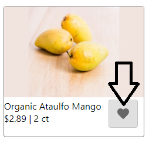
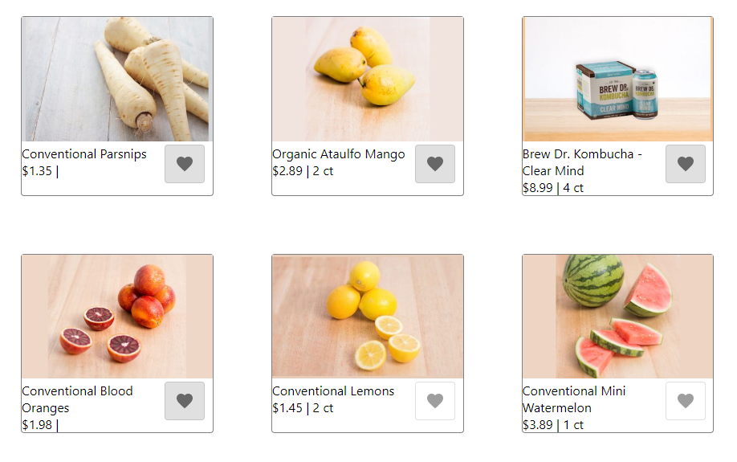

# SAFE stack Product Card Exercise with Event Sourced User Favorites

By [Anthony Zavala](https://www.linkedin.com/in/anthony-zavala-874a521b/)

## Instructions

1. Clone locally using
    `git clone git@github.com/zavalaan/SAFE-product-card-exercise.git`
    or
    `git clone https://github.com/zavalaan/SAFE-product-card-exercise.git`
2. Install dependencies using `npm install` or ` npm i`
3. Run tests using `dotnet test`
4. Start the server and client concurrently using `fake build --t run`
6. Open [http://localhost:8080](http://localhost:8080) to view it in the browser.

[SAFE Template Instructions](#safe-template)

## Requirements
### Code that demonstrates
- Asynchronous logic – any way in which program flow must react to a
non-immediate response in a non-blocking manner. Examples: HTTP requests,
callback/Promise/async-await, queue-based/distributed events.
- Data manipulation – any way in which one or many sources of data are combined,
split apart, or massaged into a new output data shape. Examples:
projecting/translating data to a new shape, normalizing data for in-memory
storage, UI derived from multiple data sources.
- Good communication – software development is a collaborative process, and others
will need to understand and maintain your code.

Keep it small in scope so that you can complete it within 2 hours.

## Discussion
I chose to implement user favorites. Giving customers a way to mark products so that they are saved.

The implemented feature can be utilized by clicking on the heart icon in each individual product card. Shaded means the product has been selected as a favorite.  


When the page is first loaded, your user is persisted in the browser's LocalStorage. Refreshing the page after some products have been selected will result in the favorites being displayed first.  


Implementing user favorites provided me we a path to showcase an in-memory event sourcing solution. Asynchronous logic is demonstrated using HTTP calls between the react client and the node server in order to get Product and User data, as well as post User commands. Additionally, if this were to be a production ready solution, I would also be emitting the user events on a message bus. Data manipulation is demonstrated by storing the user events individually and using a fold function to replay the events into the current state. The UI is also derived from multiple data sources by using the user's favorites to reorder the products on page load.

## Unhappy Paths
In order to keep the solution small, I mostly only accounted for the success cases. Here is a list of some considered but incomplete paths that I would complete if this solution was to be shipped into production.

- Failure events are returned from the API, but they are not displayed to the user. I would add a notification of failure to the UI.
- Retry logic when calls to the API fail.
- Real persistance, something that has quick lookup by key so that the event collections are returned quickly.
- A projector component that would create a view of the current user states, fed from a stream of events from a message bus. Replaying events on each get will begin to under perform quickly.

---

# SAFE Template

This template can be used to generate a full-stack web application using the [SAFE Stack](https://safe-stack.github.io/). It was created using the dotnet [SAFE Template](https://safe-stack.github.io/docs/template-overview/). If you want to learn more about the template why not start with the [quick start](https://safe-stack.github.io/docs/quickstart/) guide?

## Install pre-requisites

You'll need to install the following pre-requisites in order to build SAFE applications

* The [.NET Core SDK](https://www.microsoft.com/net/download)
* [FAKE 5](https://fake.build/) installed as a [global tool](https://fake.build/fake-gettingstarted.html#Install-FAKE)
* The [Yarn](https://yarnpkg.com/lang/en/docs/install/) package manager (you an also use `npm` but the usage of `yarn` is encouraged).
* [Node LTS](https://nodejs.org/en/download/) installed for the front end components.
* If you're running on OSX or Linux, you'll also need to install [Mono](https://www.mono-project.com/docs/getting-started/install/).

## Work with the application

To concurrently run the server and the client components in watch mode use the following command:

```bash
fake build -t Run
```


## SAFE Stack Documentation

You will find more documentation about the used F# components at the following places:

* [Saturn](https://saturnframework.org/docs/)
* [Fable](https://fable.io/docs/)
* [Elmish](https://elmish.github.io/elmish/)
* [Fulma](https://fulma.github.io/Fulma/)

If you want to know more about the full Azure Stack and all of it's components (including Azure) visit the official [SAFE documentation](https://safe-stack.github.io/docs/).

## Troubleshooting

* **fake not found** - If you fail to execute `fake` from command line after installing it as a global tool, you might need to add it to your `PATH` manually: (e.g. `export PATH="$HOME/.dotnet/tools:$PATH"` on unix) - [related GitHub issue](https://github.com/dotnet/cli/issues/9321)
